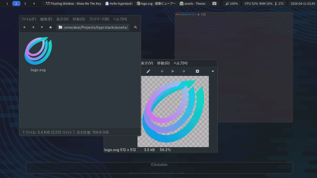

# hyprstack

<p align="center">
  
</p>

<p align="center">
  <a href="./README.md">English</a> · <a href="./README.ja.md">日本語</a>
</p>

`hyprstack` is a [Hyprland](https://github.com/hyprwm/Hyprland) plugin that adds a stable per-workspace window stack.

Hyprland already has focus history, z-order, layout order, and other ordering concepts. `hyprstack` provides a separate stack model for keybind-friendly `next`, `prev`, `last`, and `swap` operations.

<p align="center">
  
</p>

## Features

- Keeps a stable order per workspace
- Tracks the current window and the last-focused window
- Focuses `next`, `prev`, and `last` from keybinds
- Swaps the current window with its neighbor
- Exposes stack state through `hyprctl`

## Installation

`hyprstack` is intended to be managed with `hyprpm`.

```sh
hyprpm add https://github.com/ver-1000000/hyprstack.git
hyprpm enable hyprstack
```

Load `hyprpm` plugins when Hyprland starts.

Lua:

```lua
hl.on("hyprland.start", function()
    hl.exec_cmd("hyprpm reload")
end)
```

`.conf`:

```conf
exec-once = hyprpm reload
```

## Keybind Examples

Lua configs can call stack actions through `hyprctl hyprstack`.

```lua
hl.bind(mainMod .. " + TAB", hl.dsp.exec_cmd("hyprctl hyprstack focus last"))
hl.bind(mainMod .. " + J", hl.dsp.exec_cmd("hyprctl hyprstack focus next"))
hl.bind(mainMod .. " + K", hl.dsp.exec_cmd("hyprctl hyprstack focus prev"))

hl.bind("SHIFT + " .. mainMod .. " + J", hl.dsp.exec_cmd("hyprctl hyprstack swap next"))
hl.bind("SHIFT + " .. mainMod .. " + K", hl.dsp.exec_cmd("hyprctl hyprstack swap prev"))
```

`.conf` configs can call dispatchers directly.

```ini
bind = $mainMod, TAB, stackfocus, last
bind = $mainMod, J, stackfocus, next
bind = $mainMod, K, stackfocus, prev

bind = SHIFT $mainMod, J, stackswap, next
bind = SHIFT $mainMod, K, stackswap, prev
```

## Query

Use these commands for scripts and debugging.

```sh
hyprctl hyprstack stack list
hyprctl hyprstack stack current
hyprctl hyprstack stack around
```

`stack around` returns stable-order `prev` / `next` and focus-history-based `last`.

## Floating Stack

`hyprstack` only handles window order and focus/swap actions. Whether windows float and how large they are is Hyprland config responsibility.

For floating stack workflows, opening normal floating windows at a large size is safer than using `maximize` / `fullscreen`.

```lua
hl.window_rule({
    name = "floating-stack",
    match = { class = ".*" },
    float = true,
    center = true,
    size = { "monitor_w * 0.96", "monitor_h * 0.94" }, -- leave some room for bars and outer margins
})
```
